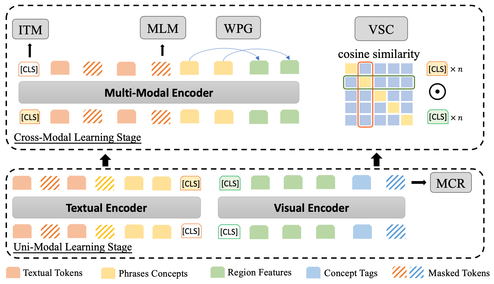
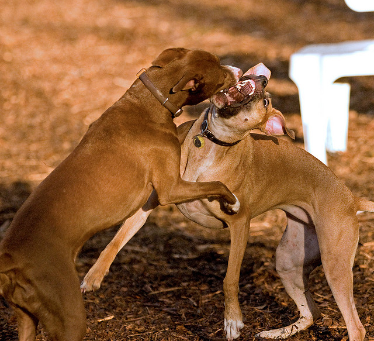

# MVPTR: Multi-Stage Vision-Language Pre-Training via Multi-Level Semantic Alignment

## Introduction

This repository is the implementation of our ACM MM 22 paper [MVPTR: Multi-Stage Vision-Language Pre-Training via Multi-Level Semantic Alignment](https://arxiv.org/abs/2201.12596). In this paper, we propose to explicitly align vision and language at multiple levels. In MVP, we firstly introduce concepts in both modalities to construct two-level semantic representations for language and vision, then we design a 2-stage pre-training framework to learn intra-modal and cross-modal interaction respectively. The procedure is illustrated in the figure below:



Our implementation is based on the project [Oscar&VinVL](https://github.com/microsoft/Oscar), many thanks to Microsoft for the open-source resource.

## Performance

We pre-trained our MVP model with the base-setting and evaluate it on image-text retrieval, VQA, visual entailment, and referring expression.

| Task   | MSCOCO | MSCOCO | Flickr | Flickr |   VQA    |   VQA    |   SNLI-VE   |
| ------ | :----: | :----: | :----: | :----: | :------: | :------: | :---------: |
| Metric | IR R@1 | TR R@1 | IR R@1 | TR R@1 | Test-dev | Test-std |  Val/Test   |
| ALBEF  |  56.8  |  73.1  |  82.8  |  94.3  |  74.54   |  74.70   | 80.14/80.30 |
| VinVL  |  58.1  |  74.6  |   -    |   -    |  75.95   |  76.12   |    - / -    |
| MVPTR  |  60.1  |  77.3  |  84.0  |  95.2  |  76.16   |  76.36   | 80.30/80.17 |

MSCOCO: 5k test; IR: Image Retrieval; TR: Text Retrieval, R@1: Recall at 1, VQA: VQA v2

For full results, please refer to our paper.

## Installation

```bash
# create environment
conda create --name mvp python=3.7
conda activate mvp

# install pytorch1.7
pip install torch==1.7.1+cu101 torchvision==0.8.2+cu101 torchaudio==0.7.2 -f https://download.pytorch.org/whl/torch_stable.html

# run setup
python setup.py build develop

# install requirements
pip install -r requirements.txt

mkdir pretrained_models
mkdir pretrain_datasets
```

### Data Preprocess:

To transform image-text pairs to fit the MVP input, there are several steps: 

1. We utilize the off-the-shelf scene graph parser provided in [SPICE](https://github.com/peteanderson80/SPICE) to extract tuples from text, which are considered as phrase concepts.
2. Only general phrases which appear in at least 50 sentences in the pre-training corpus are considered, the id2phrase mapping is stored in [id2phrase](). Extracted phrases for coco, Flickr, vqa, visual entailment, referring expression can be downloaded from [here](https://drive.google.com/file/d/1fl8vXvxw9ZXmLaQ6a_4KrM-Zi1w_PgwN/view?usp=sharing).
3. Object features and tags are extracted from images with [the object detector used in VinVL](https://github.com/microsoft/scene_graph_benchmark).

To download extracted features used in VinVL and MVP, it is recommended to use [azcopy](https://docs.microsoft.com/en-us/azure/storage/common/storage-use-azcopy-v10#download-azcopy).

## Usage

For the convenience of usage, we considered three different scenarios:
- For a quick start to use MVPTR, we provide a complete pipeline which takes raw image-text pairs as inputs, please check the Quick Start section.
- To utilize MVPTR on the already-implemented tasks (image text retrieval, vqa, SNLI-VE, Referring Expression), please check the  section that corresponds to the task and dataset.
- To fine-tune MVPTR on datasets that are not considered in our experiments, please check the Fine-Tuning on Custom Datasets section.

### Prepare the Tools

If you are willing to use the pipeline or fine-tune on your custom data, several tools need to be prepared before you start:

1. The object detector used to extract region features, we provide a [torchscripted version of VinVL](https://drive.google.com/file/d/1gKlE-uzjGC7HbRawTZgj4Nrvy-LuQpyE/view?usp=sharing), which is a simple .pt file and can be directly used by:

   ```python
   import torchvision, torch
   od_model = torch.jit.load('OD_MODAL_PATH')
   ```

   You can download it from (to be uploaded, coming soon)

2. The SPICE parser to extract phrases from texts, we provide a script to help you:

   ```bash
   bash tools/prepare_spice.sh
   ```

   
### Quick Start

We provide a complete pipeline of MVPTR which performs masked language model or generates contextual representations directly from the image-text input, it can be used only for inference (the encoded representations can be freezed and used for your own tasks).

You can quickly test MVPTR, first download [pretrained_base](https://drive.google.com/file/d/1t9S9ejwpit7UO_Y5f9pYnn7p9g-AtWtC/view?usp=sharing) to pretrained_mdoels/base and use the mlm pipeline:

```python
from oscar.modeling.modeling_pipeline import InferencePipeline

pipeline = InferencePipeline(model_name='mlm', model_path='pretrained_models/base/', 'OD_MODEL_PATH', od_config_dir='tools/configs/', parser_path='tools/spice', id2phrase='datasets/mvp/id2phrase_new.json')
print(inference.inference('figs/coco_test.jpg', 'two [MASK] are playing on a ground'))
```

Based on the image, our model generates the "dogs" output:



If you change the model_name from "mlm" to "embedding", the pipeline generates the contextual representations of all tokens, phrase concepts and regions, which can be used for downstream task (both cross-modal output and uni-modal output).

Notice that it is not recommended to use the pipeline for fine-tuning, but you can refer to the implementation of the pipeline to better understand how to use MVPTR. If you need to fine-tune the MVPTR, you need to first extract and regions features and phrases, please refer to the sub-sections below.

### Image-Text Retrieval

#### Flickr30k

As the original pre-trained VinVL uses the test split of Flickr30k during pre-training, we exclude those data and pre-train our MVP to avoid the information leaking:

1. Download the pre-trained checkpoint for flickr30k retrieval: [mvp_base_for_fk](https://drive.google.com/file/d/19L2ej4s-fhm5qCQzI2g3pxgVIrdd9FeV/view?usp=sharing)

2. Download the extracted features and captions from: [fk_ir](https://drive.google.com/file/d/1L4xXrk3q0e6DsBiucJkUFWbxqPLtzRjY/view?usp=sharing)

3. Training with evaluation on the validation split:

```bash
python3 oscar/run_retrieval.py \
    --model_name_or_path pretrained_models/base_for_fk/ \
    --data_dir datasets/fk_ir --do_train --do_lower_case \
    --per_gpu_train_batch_size 64 --learning_rate 0.00004 \
    --num_train_epochs 10 --weight_decay 0.05 \
    --save_steps 400 --add_od_labels --od_label_type vg \
    --max_seq_length 50  --evaluate_during_training \
    --num_captions_per_img_val 128 --num_images_per_cap_val 64 \
    --max_img_seq_length 50  --dataset_name flickr \
    --max_phrases 5  --sent_sg datasets/fk_ir/fk_sg.pt \
    --id2node datasets/mvp/id2phrase_new.json \
    --output_dir output_fk/mvp_std/
```

4. Evaluation on the test split:

```bash
python3 oscar/run_retrieval.py \
    --eval_model_dir output_fk/mvp_std/checkpoint-x-x \
    --data_dir datasets/fk_ir --do_test --do_eval --do_lower_case \
    --per_gpu_eval_batch_size 128 --add_od_labels --od_label_type vg \
    --max_seq_length 50  --test_split test \
    --num_captions_per_img_val 128 --num_images_per_cap_val 64 \
    --max_img_seq_length 50  --dataset_name flickr \
    --max_phrases 5  --sent_sg datasets/fk_ir/fk_sg.pt \
    --id2node datasets/mvp/id2phrase_new.json \
    --output_dir output_fk/mvp_std/
```

We found that MVP quickly converges to the best performance within 2 epochs.

#### MSCOCO

1. Download the tsv-format features: 

   ```bash
   path/to/azcopy copy 'https://biglmdiag.blob.core.windows.net/vinvl/image_features/coco_X152C4_frcnnbig2_exp168model_0060000model.roi_heads.nm_filter_2_model.roi_heads.score_thresh_0.2/model_0060000/' pretrain_datasets/coco --recursive
   ```

2. Download the captions:

   ```bash
   path/to/azcopy copy 'https://biglmdiag.blob.core.windows.net/vinvl/datasets/coco_ir' datasets/ --recursive
   ```

3. Download the pre-trained checkpoint: [mvp_base_for_coco](https://drive.google.com/file/d/1VUl9TbtkKYB8BDc9Xk-a9G0XYTnyUwpz/view?usp=sharing)

4. Training with evaluation on the 1k minival split:

   ```bash
   python3 oscar/run_retrieval.py \
       --model_name_or_path pretrained_models/base_for_coco/ \
       --per_gpu_train_batch_size 96 --learning_rate 0.00004 \
       --num_train_epochs 15 --weight_decay 0.05 \
       --save_steps 400 --add_od_labels --od_label_type vg \
       --max_seq_length 50  --evaluate_during_training \
       --num_captions_per_img_val 128 --num_images_per_cap_val 64 \
       --max_img_seq_length 50 \
       --id2node datasets/mvp/id2phrase_new.json \
       --do_train  --img_feat_file pretrain_datasets/coco/model_0060000/features.tsv \
       --do_lower_case  --data_dir datasets/coco_ir/ \
       --evaluate_during_training  --max_tag_length 30 \
       --output_dir output_coco/mvp --dataset_name coco \
       --max_phrases 5  --sent_sg datasets/coco_ir/coco_full_sg.pt
   ```

4. Evaluationation on the 5k test split:

   ```bash
   python3 oscar/run_retrieval.py \
       --eval_model_dir output_coco/mvp/checkpoint-x-x \
       --num_captions_per_img_val 128 --num_images_per_cap_val 64 \
       --test_split test  --eval_img_keys_file test_img_keys.tsv \
       --id2node datasets/mvp/id2phrase_new.json --do_test --do_eval \
       --img_feat_file pretrain_datasets/coco/model_0060000/features.tsv \
       --do_lower_case  --data_dir datasets/coco_ir/ \
       --output_dir evaluate_coco/mvp --dataset_name coco \
       --max_phrases 5  --sent_sg datasets/coco_ir/coco_full_sg.pt
   ```

### VQA

1. In VQA, we found it useful to initialize the classifier head with the weights used in MLM task, the initialized checkpoint can be downloaded from: [mvp_base_for_vqa](https://drive.google.com/file/d/1QsUHakD1tEip7txe7BUiMgDcnI1AtOva/view?usp=sharing)

2. Download vqa dataset:

   ```bash
   path/to/azcopy copy "https://biglmdiag.blob.core.windows.net/vinvl/datasets/vqa" datasets/ --recursive
   ```

   and we re-use the tsv-format coco image features mentioned in MSCOCO retrieval.

3. To achieve the best performance, the model is trained on train and val splits:

   ```bash
   python3 oscar/run_vqa.py -j 4 --img_feature_dim 2054 --max_img_seq_length 50 \
       --data_label_type mask --img_feature_type faster_r-cnn --data_dir datasets/vqa/ \
       --model_type bert --model_name_or_path pretrained_models/base_for_vqa/ \
       --task_name vqa_text --do_train_val --do_lower_case \
       --max_seq_length 128 --per_gpu_eval_batch_size 256 \
       --per_gpu_train_batch_size 32 --learning_rate 5e-05 \
       --num_train_epochs 25 --add_od_labels \
       --output_dir output_vqa/mvp/ --label_file datasets/vqa/trainval_ans2label.pkl \
       --save_epoch 1 --seed 88 --evaluate_during_training \
       --logging_steps 20 --eval_step 4000 --drop_out 0.3 \
       --weight_decay 0.05 --warmup_steps 0 --loss_type bce \
       --img_feat_format tsv --img_feat_dir pretrain_datasets/coco/model_0060000/ \
       --classifier linear --cls_hidden_scale 3 --txt_data_dir datasets/vqa \
       --max_tag_length 30 --use_pretrain --use_b_text --b_as_list
   ```

4. Predict the answers:

   ```bash
   python3 oscar/run_vqa.py -j 4 --img_feature_dim 2054 --max_img_seq_length 50 \
       --data_label_type mask --img_feature_type faster_r-cnn --data_dir datasets/vqa/ \
       --model_type bert --model_name_or_path pretrained_models/base_for_vqa/ \
       --task_name vqa_text --do_test --do_lower_case \
       --max_seq_length 128 --per_gpu_eval_batch_size 256 \
       --label2ans_file datasets/vqa/trainval_label2ans.pkl  --add_od_labels \
       --output_dir output_vqa/mvp/checkpoint-5-15120/ \
       --label_file datasets/vqa/trainval_ans2label.pkl --img_feat_format tsv \
       --img_feat_dir pretrain_datasets/coco/model_0060000/coco2015test/ \
       --classifier linear --cls_hidden_scale 3 --txt_data_dir datasets/vqa \
       --max_tag_length 30  --use_pretrain  --use_b_text --b_as_list
   ```

Here is the detailed evaluation results from the VQA challange on EvalAI:

```json
[{"test-dev": {"yes/no": 91.55, "number": 58.47, "other": 67.04, "overall": 76.16}}, {"test-standard": {"yes/no": 91.65, "number": 58.45, "other": 67.16, "overall": 76.36}}]
```

### SNLI-VE

1. Download the dataset: coming soon.

2. Download the pre-trained checkpoint: [mvp_base](https://drive.google.com/file/d/1t9S9ejwpit7UO_Y5f9pYnn7p9g-AtWtC/view?usp=sharing)

3. Training:

   ```bash
   python3 oscar/run_ve.py -j 4 --img_feature_dim 2054 --max_img_seq_length 70 \
       --img_feature_type faster_r-cnn --data_dir datasets/ve/ --output_dir output_ve/mvp/ \
       --model_type bert --model_name_or_path pretrained_models/base/ \
       --task_name ve --do_train --do_lower_case --max_seq_length 70 \
       --per_gpu_eval_batch_size 128 --per_gpu_train_batch_size 64 \
       --learning_rate 4e-05 --num_train_epochs 25 --add_od_labels \
       --save_epoch 1 --seed 88 --evaluate_during_training \
       --logging_steps 20 --eval_step 400 --drop_out 0.1 \
       --weight_decay 0.05 --warmup_steps 0 --loss_type ce \
       --img_feat_format pt --img_feat_dir datasets/ve/ \
       --classifier linear --cls_hidden_scale 3 --txt_data_dir datasets/ve \
       --max_tag_length 20 --bivinvl_id2phrase datasets/mvp/id2phrase_new.json
   ```
   
4. Evaluation:

   ```bash
   python3 oscar/run_ve.py -j 4 --img_feature_dim 2054 --max_img_seq_length 70 \
       --img_feature_type faster_r-cnn --data_dir datasets/ve/ \
       --output_dir output_ve/mvp/checkpoint-0-1035 \
       --model_type bert --model_name_or_path pretrained_models/base/ \
       --task_name ve --do_test --do_lower_case --max_seq_length 70 \
       --per_gpu_eval_batch_size 128 --add_od_labels \
       --img_feat_format pt --img_feat_dir datasets/ve/ \
       --classifier linear --cls_hidden_scale 3 --txt_data_dir datasets/ve \
       --max_tag_length 20 --bivinvl_id2phrase datasets/mvp/id2phrase_new.json
   ```

### Referring Expression

1. Download the dataset: [re](https://drive.google.com/file/d/1DmDM351JQdaTbS-WwU7VtxwJX5QitKUY/view?usp=sharing), we also re-use the tsv-format coco data.

2. Download the pre-trained checkpoint: [mvp_base](https://drive.google.com/file/d/1t9S9ejwpit7UO_Y5f9pYnn7p9g-AtWtC/view?usp=sharing)

3. Training:

   ```bash
   python3 oscar/run_re.py -j 4 --img_feature_dim 2054 --max_img_seq_length 50 \
       --img_feature_type faster_r-cnn --data_dir datasets/re/ --output_dir output_re/mvp/ \
       --model_type bert --model_name_or_path pretrained_models/base/ \
       --task_name re --do_train --do_lower_case --max_seq_length 30 \
       --per_gpu_eval_batch_size 256 --per_gpu_train_batch_size 64 \
       --learning_rate 4e-05 --num_train_epochs 25 --add_od_labels \
       --save_epoch 1 --seed 88 --evaluate_during_training \
       --logging_steps 20 --eval_step 1000 --drop_out 0.1 \
       --weight_decay 0.05 --warmup_steps 0 --img_feat_format tsv \
       --img_feat_dir pretrain_datasets/coco/model_0060000/ \
       --classifier linear --cls_hidden_scale 3 --txt_data_dir datasets/re \
       --max_tag_length 20  --loss_mod 1 \
       --bivinvl_id2phrase datasets/mvp/id2phrase_new.json \
       --data_file datasets/re/ve_splits.json --phrase_layer 2
   ```

### Fine-Tuning on Custom Datasets

As MVPTR relies on region-based feature and extracted phrases, the whole dataset needs to be processed to extract and store the features, which will improve the training efficiency than the pipeline.

 #### Data Preparation

For input image-text pairs, you need to configure them into a list of dictionaries as:

```json
[{'text': 'A child holding a flowered umbrella and petting a yak.',
  'image_id': 'test_img',
  'label': 1},
 {'text': 'A narrow kitchen filled with appliances and cooking utensils.',
  'image_id': 'test_img1',
  'label': 1}]
```

then you can simply runs the following comman to extract the phrases and get the output:

```bash
bash tools/phrase_parse.sh YOUR_INPUT_DATA
```

the output is named as "processed_YOUR_INPUT_DATA" should be like:

```json
[{'text': 'A child holding a flowered umbrella and petting a yak.',
  'image_id': 'test_img',
  'label': 1,
  'phrases': [['child'], ['umbrella'], ['umbrella', 'flowered'], ['yak']]},
 {'text': 'A narrow kitchen filled with appliances and cooking utensils.',
  'image_id': 'test_img1',
  'label': 1,
  'phrases': [['appliance'],
   ['kitchen'],
   ['kitchen', 'fill with', 'appliance'],
   ['kitchen', 'fill with', 'utensil'],
   ['kitchen', 'narrow'],
   ['utensil'],
   ['utensil', 'cooking']]}]
```

For images, put all images into a directory "YOUR_IMAGE_DIR", then run:

```bash
python3 tools/img_feat_extract.py --vinvl_od_path tools/DOWNLOADED_OD_MODEL \
    --image_dir YOUR_IMAGE_DIR  --od_config_dir tools/configs/  --device cuda
```

This will generate a predictions.tsv file containing the extracted features.

Please ensure that the image filename is the same as the ones in your input data processed above (or you can make your own mapping and implement it).

#### General Dataset

To help you understand the construction process of inputs, we provide a general dataset implementation:

```python
from oscar.datasets.general_dataset import MVPTRDataset

test_dataset = MVPTRDataset(tokenizer_path='pretrained_models/base/', img_feat_file='YOUR_IMAGE_DIR/predictions.tsv', input_data='processed_YOUR_INPUT_DATA', id2phrase='datasets/mvp/id2phrase.json', max_seq_length=50, max_img_seq_length=50, max_tag_length=20, max_phrases=5)

# sample output
index, [input_ids_a, input_mask_a, segment_ids_a, input_ids_b, input_mask_b, segment_ids_b, img_feat] = test_dataset[index]
"""
input_ids_a:   shape [max_seq_length+max_phrases], encoded tokens and phrases
input_mask_a:  shape [max_seq_length+max_phrases], attention mask of textual sequence
segment_ids_a: shape [max_seq_length+max_phrases], token type ids of textual sequence 
input_ids_b:   shape [max_tag_length],             encoded object tags
input_mask_b:  shape [max_tag_length+max_img_seq_length], attention mask of visual sequence
segment_ids_b: shape [max_tag_length+max_img_seq_length], token type ids of visual sequence
img_feat:      shape [max_img_seq_length, 2054],         extracted object features
"""
```

#### Model Input & Output

Here we provide a example to illustrate the normal input and output

```python
from oscar.modeling import BiImageBertRep

model = BiImageBertRep.from_pretrained('pretrained_models/base/')
# sample output
sequence_output, pooled_output, single_stream_output = model(input_ids_a=input_ids_a, attention_mask_a=input_mask_a, token_type_ids_a=segment_ids_a, input_ids_b=input_ids_b, attention_mask_b=input_mask_b, token_type_ids_b=segment_ids_b, img_feats=img_feat, max_tag_length=max_tag_length)
text_encoder_output, vis_encoder_output = single_stream_output
"""
sequence_output:   shape [batch_size, max_seq_length+max_phrases+max_img_seq_length, 768], encoded representations of {cls, tokens, phrases, region_features}
pooled_output:  shape [batch_size, 768], 
text_encoder_output: shape [batch_size, max_seq_length+max_phrases, 768], textual encoder's output of {cls, tokens, phrases} 
vis_encoder_output:   shape [batch_size, max_img_seq_length+max_tag_length, 768], visual encoder's output of {cls, object tags, regions_features}
"""
```

You can modify the BiImageBertRep to fit your input and output.

There is an detailed step-by-step version of instructions in [INSTRUCTIONS.md](https://github.com/Junction4Nako/mvp_pytorch/blob/master/INSTRUCTIONS.md),  you can also check the pipeline implementation to check the working logic.

## Citations

Please consider citing this paper if you find this repository useful:

```latex
@article{li2022mvp,
  title={MVP: Multi-Stage Vision-Language Pre-Training via Multi-Level Semantic Alignment},
  author={Li, Zejun and Fan, Zhihao and Tou, Huaixiao and Wei, Zhongyu},
  journal={arXiv preprint arXiv:2201.12596},
  year={2022}
}
```

